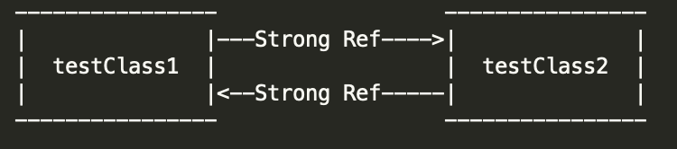

# ARC与Retain Cycle

作为iOS编程中一个非常常见又独特的内容，`Retain Cycle`绝对是面试中的重点考察的内容，尤其是在面试Apple的时候，这基本就是一道必考题。

我们先来看看ARC的工作机制：

## ARC（Auto Reference Counting）工作机制

在创建一个类的实例时，ARC 会分配一大块内存来存储这个实例的信息。这些内存中保留有实例的类型信息，以及该实例所有存储属性值的信息。当实例不需要时，ARC 会释放该实例所占用的内存，释放的内存用于其他用途。这确保类实例当它不在需要时，不会一直占用内存。那么，ARC该如何决定何时释放该实例占用的内存呢？在这里，ARC 会跟踪和计算当前实例被多少属性，常量和变量所引用。所以说只要存在对该类实例的引用，ARC 将不会释放该实例。

## Retain Cycle

简单地来说，`Retain Cycle`的形成就是两个或多个实例之间强互相引用，导致不能被ARC正确地回收这样的一个问题。

我们来看一个简单地例子：

``` swift
class TestClass { 
    var testClass: TestClass? = nil
    init() {
        print("init")
    }
    
    deinit {
        print("deinit")
    }
}
 
var testClass1: TestClass? = TestClass()
var testClass2: TestClass? = TestClass()
 
testClass1?.testClass = testClass2
testClass2?.testClass = testClass1

testClass1 = nil
testClass2 = nil
//print: 
//init
//init
```

在这里，我们的testClass1实例对testClass2实例有一个强引用，同时testClass2实例对testClass1实例也有一个强引用，所以就算我们将testClass1和testClass2的指针都指向nil，testClass1的实例和testClass2的实例还是各自保有一个引用计数，所以ARC并不会释放这两个实例的内存空间。



## Weak与Unowned

解决Retain Cycle的方式也比较简单，就是将一个Retain Cycle中的某一个强引用替换为`weak reference`或者`unowned reference`，这样的话，ARC就能够正确地回收被占用的内存。

### weak

`weak reference`不会对其引用的实例保持强引用，因而不会阻止 ARC 释放被引用的实例。这个特性阻止了引用变为循环强引用。声明属性或者变量时，在前面加上 weak 关键字表明这是一个弱引用。

由于弱引用不会强保持对实例的引用，所以说实例被释放了弱引用仍旧引用着这个实例也是有可能的。因此，ARC 会在被引用的实例被释放是自动地设置弱引用为 nil 。由于弱引用需要允许它们的值为 nil ，它们一定得是可选类型。而且，在 ARC 给弱引用设置 nil 时不会调用`Property Observer`。

比如上面的例子，我们简单地修改一下之后：

``` swift
class TestClass { 
    weak var testClass: TestClass? = nil
    init() {
        print("init")
    }
    
    deinit {
        print("deinit")
    }
}
 
var testClass1: TestClass? = TestClass()
var testClass2: TestClass? = TestClass()
 
testClass1?.testClass = testClass2
testClass2?.testClass = testClass1

testClass1 = nil
testClass2 = nil
//print: 
//init
//init
//deinit
//deinit
```

### unowned

就像之前我再function和closure一节中提到过，`unowned`和`weak`类似，不会形成强引用，而且可以用类似`Implict Unwrap`的方式对待一个变量。无主引用假定是*永远*有值的。因此，无主引用总是被定义为非可选类型。在声明属性或者变量时，在前面加上关键字 unowned 表示这是一个无主引用。

## Apple电面题

最后我们来看一道Apple的电面题：

``` swift
import Foundation

class Book {
    static private(set) var counter = 0
    private var pages = [Page]()
    
    init() {
        Book.counter += 1
    }
    func add(_ page: Page) {
        pages.append(page)
    }
}

class Page {
    static private(set) var counter = 0
    private var book: Book

    required init(book: Book) {
        self.book = book
        Page.counter += 1
    }
}

// ^^------------------------^^---------------------------------^^
// How would you change the above code to get the expected output?
//

var library = [Book]()
for _ in 0 ..< 10 {
    // Create new book
    let book = Book()
    // Add random amount (1-10) of pages to a book
    let pageCount = Int.random(in: 1 ... 10) 
    for _ in 0 ..< pageCount {
        // Create new page
        let page = Page(book: book)
        // Add page to the book
        book.add(page)
    }
    // Add book to the library
    library.append(book)
}

print("\nAdded new books to a library")
print("Total books: \(Book.counter)")
print("Total pages: \(Page.counter)")

library.removeFirst()
print("Removed one book from the library")
print("Total books: \(Book.counter)")
print("Total pages: \(Page.counter)")


library.removeAll()
print("Removed all books from a library")
print("Total books: \(Book.counter)")
print("Total pages: \(Page.counter)")
```

点击run之后，我们会发现代码并不会按照我们的意思输出，题目要求**只能更改两个Book和Page中的代码**来修正bug。

这道题中的代码其实有些反直觉，大致梳理一下就是这里的`Book`类中有一个存储`Page`类实例的数组，而`Page`类中又有一个属性指向包含它自身的`Book`类的实例。这两个类中又各自都有一个`Type Property`来记录一共实例化了多少`Book`实例和`Page`实例。

如果我们运行上面的代码，我们会看到每次的输出结果都是一样的。很明显，代码中并没有在`Book`实例和`Page`实例`deinit`时修改各自的`counter`的值。那么我们先做出一下的修改：

``` swift
class Book {
		...
    deinit {
        Book.counter -= 1
    }
		...
}

class Page {
    ...
    deinit {
      Page.counter -= 1 
    }
}
```

那么，我们在作出这样的修改之后，结果是否会按照我们的想法输出呢？答案是否定的，因为这里存在Retain `Cycle`：`Book`的实例和它包含的`Page`实例之间存在强引用的关系，所以即使`Book`实例从`library`中移除，ARC也不会回收`Book`实例和它包含的`Page`实例，而我们添加的`deinit`方法也不会被调用。所以我们只要将`private var book: Book`改为弱引用就可以了。这里的话，个人比较推荐使用`unowned`，因为很明显`Book`和`Page`拥有相同的`life cycle`,而且`unowned`也很好地形容了两者之间的关系：`Page`实例并**不持有**`Book`实例。

所以，最后我们得到下面的代码：

``` swift
class Book {
    static private(set) var counter = 0
    private var pages = [Page]()
    
    init() {
        Book.counter += 1
    }
    
    deinit {
        Book.counter -= 1
    }

    func add(_ page: Page) {
        pages.append(page)
    }
}

class Page {
    static private(set) var counter = 0
    private unowned var book: Book

    required init(book: Book) {
        self.book = book
        Page.counter += 1
    }
  
    deinit {
      Page.counter -= 1 
    }
}
```

运行之后，我们会看到代码输出的结果和预期的相同

``` swift
Added new books to a library
Total books: 10
Total pages: 53
Removed one book from the library
Total books: 9
Total pages: 48
Removed all books from a library
Total books: 0
Total pages: 0
```

