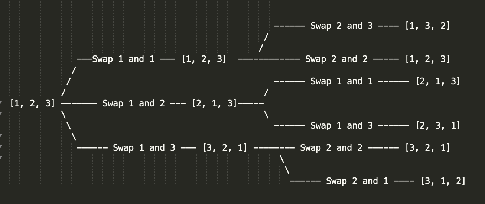

# DFS与Backtracking（中频）

## 经典DFS

就如同我在BFS中所说的，大多数的图的搜索题目，用BFS解的同时，也能够使用DFS来解决。而且回顾一下之前在Tree中涉及的题目，其中大多数也都是DFS的题目——因为DFS的问题归根结底，就是**递归**问题。而且对于DFS来说，在每一个节点上，我们都有`[0...N]`个选择枝，所以DFS最后形成的路径就是一个`N叉树`。

既然DFS问题其实就是**递归**问题，那么我们又可以绕回到我们熟悉的话题了——递归三要素。所有的DFS题，都能够套用这三要素来处理。

不过DFS中也有一类比较重要的题目——Backtracking（回溯），我在本节中也会花一些篇幅来详细阐述这一类的题目，并提供一个解题模板。

话不多说，我们先来看看一些常规的DFS题目的模板，然后再看几道高频题目。

### 模板

``` swift
func dfs() {
	if current node is visited {
    return 
  } 
  mark current node as visited
  for next in currentNode.nexts {
    dfs(next)
  }
}
```

上面就是经典DFS的模板了，可以看到十分简单，但是就是这个简单的模板，就能够解决大多数的DFS题目。按照惯例，我们来分析一下递归三要素：

* 结束条件：如果当前的节点或元素已经被检查过了，结束当前的`dfs`调用。
* 在每一层的调用中需要做什么: 将当前的节点或元素标记为**已检查**，并对所有的相邻节点调用`dfs`。
* 返回值：无。

好了，经典DFS的模板就是这么简单，下面来看看一些常见的题目吧。

### [Friend Circles](https://leetcode.com/problems/friend-circles/)

这是一道典型的DFS题目，题目十分直白，我们只要套用模板就可以了。先来看一下逻辑：

> 我们循环检查所有的学生，如果当前的学生没有被检查过，那么我们从当前学生开始做DFS，并将其所有朋友都标记为『已检查』并将FriendCycleCounter加一。当我们完成循环时，我们也就得到了我们的结果。

话不多说，直接来看代码：

``` swift
func findCircleNum(_ M: [[Int]]) -> Int {
    let n = M.count
    var visited: [Bool] = Array(repeating: false, count: n)
    var count = 0
    for i in 0 ..< n {
        if !visited[i] {
            dfsSearch(M, &visited, i)
            count += 1
        }
    }
    return count
}


func dfsSearch(_ matrix: [[Int]], _ visited: inout [Bool], _ index: Int) {
    guard !visited[index] else { return }
    visited[index] = true

    let friends = matrix[index]

    for i in 0 ..< friends.count {
        if friends[i] == 1 {
            dfsSearch(matrix, &visited, i)
        }
    }
}
```

可以看到在`dfsSearch`中，我们直接套用了上面的模板，这也是最经典的DFS应用之一。

### [Minesweeper](https://leetcode.com/problems/minesweeper/)

这道题目和我们在BFS中提到的[Number of Islands](https://leetcode.com/problems/number-of-islands/)基本思路一致；在那一节中我们使用了BFS的解法，而在这一节里，我们来看看DFS的解法。同样的，这也是一道经典的DFS题目，我们直接套用模板就可以了。我们来看看代码：

``` swift
let dirs: [(Int, Int)] = [(0, 1), (0, -1), (1, 0), (-1, 0), (1, 1), (1, -1), (-1, 1), (-1, -1)]

func updateBoard(_ board: [[Character]], _ click: [Int]) -> [[Character]] {
    var board: [[Character]] = board
    let x = click[0]
    let y = click[1]
    if board[x][y] == "M" {
        board[x][y] = "X"
        return board
    }
    dfsSearch(&board, x, y)
    return board
}


func dfsSearch(_ board: inout [[Character]], _ x: Int, _ y: Int) {
    if x < 0 || x >= board.count || y < 0 || y >= board[0].count || board[x][y] != "E" {
        return // 当坐标越界或者当前的点不为『空』即已经检查过了时，结束DFS
    }
    let numberOfMines = getNumberOfMines(board, x, y) // 获得周围8个点的地雷数目
    if numberOfMines > 0 { 
        board[x][y] = Character(String(numberOfMines)) // 如果地雷数目大于0，更新数据且不想下搜索
    } else {
        board[x][y] = "B" // 当前左边周围没有地雷，继续扩大搜索区域
        for dir in dirs {
            dfsSearch(&board, x + dir.0, y + dir.1)
        }
    }
}

func getNumberOfMines(_ board: [[Character]], _ x: Int, _ y: Int) -> Int {
    var count = 0
    for dir in dirs {
        let newX = x + dir.0
        let newY = y + dir.1
        if newX < 0 || newX >= board.count || newY < 0 || newY >= board[0].count {
            continue
        }
        if board[newX][newY] == "M" || board[newX][newY] == "X" {
            count += 1
        }
    }
    return count
}
```

这道题目的核心思路和之前的**Number of Islands**没有本质的区别，同样是从起始点开始寻找相邻的区域。可以对比上面的给出的核心代码，不难看出除了根据题目给出的逻辑而修改的终止条件外，大致的框架是不变的。

## Backtracking（回溯）

Backtracking算是DFS中的一个分支，经典的例题也有很多，比如**Permutations**，**N-Queue**以及**Subsets**等。Backtracking与DFS最大的不同在于，当当前层的递归结束，在返回上一层的递归时，我们需要恢复当前层做出的修改。这也是**Backtracking**中的**Back**的由来。

### 模板

和经典DFS一样，我们先来看一看模板

``` swift
func backTracking(choices, selectedChoices, result) {
	if [condition is met] OR [every option is checked] {
    add selectedChoices to result
    return 
  } 
	
  for choice in choices {
    add the selected choice to the selectedChoices 
		backTracking(nextChoice, currentChoices, reuslt)
    [remove the selected choice from the selectedChoices] // 重点，千万不能忘记
  }
}
```

上面就是Backtracking的模板，简答解读一下，Backtracking就是**通过递归的方式来检查每一个组合是否符合题目给出的条件**。就上面的模板而言，大致的框架和DFS没有区别，唯一的重点在上面我已经提到了，即**remove the selectedChoice from the currentChoice**。不要着急，我们来看一道经典的Backtracking的题目，来看看这个模板是如何使用的。

### [Letter Combinations of a Phone Number](https://leetcode.com/problems/letter-combinations-of-a-phone-number/)

这道算是比较直观的Backtracking的题目，在解题之前，我们可以先分析一下如果不写代码，我们要怎么去解这道题呢？

首先我们来看题目给出的例子——『23』，要求求所有的可能的字母组合，

具体到2，这个数字可以对应『abc』三个字母，那么我们先选择字母「a」；然后再看第二个数字「3」，数字「3」对应了「def」三个字母；那么我们再选取第一个字母「d」，这时我们所有的数字都有了对应的字母，那么我们也就有了一个字母组合——「ad」，我们将其加入到我们的结果中。

这时因为我们没有多余的数字可以使用了，这意味着我们需要回到上一个数字「2」那里，重新选择一个数字「3」对应的字母。这里我们当前的组合是「ad」，当然是肯定不对的，所以在选择下一个字母之前，我们需要把「d」从当前的组合中删除。删除了之后，这次我们选择字母「e」，从而获得了第二个结果「ae」。

只有继续按照上面的逻辑，检查完所有的字母之后，我们就获得了我们的结果。

有了上面的核心思路之后，再回过头去看之前的模板，是不是就能够一一对应起来了呢？话不多说，我们来看看代码吧：

``` swift
private var numbers: [Character: [Character]] = [
    "2":["a", "b", "c"],
    "3":["d", "e", "f"],
    "4":["g", "h", "i"],
    "5":["j", "k", "l"],
    "6":["m", "n", "o"],
    "7":["p", "q", "r", "s"],
    "8":["t", "u", "v"],
    "9":["w", "x", "y", "z"]
]

func letterCombinations(_ digits: String) -> [String] {
    guard !digits.isEmpty else { return [] }
    var res: [String] = []
    var curr: [Character] = []
    backtracking(0, Array(digits), &res, &curr)
    return res
}

private func backtracking(_ index: Int, 
                          _ digits: [Character], 
                          _ res: inout [String], 
                          _ curr: inout [Character]) {
    guard index < digits.count else { 
      // index == digits.count, 说明所有的数字都已经被转换了，
      // 我们就应该将当前的组合加入到res中，并结束当前的搜索
        res.append(String(curr))
        return 
    }
		// 循环所有的当前数字可能的字母
    for number in numbers[digits[index]]! {
        curr.append(number)
        backtracking(index + 1, digits, &res, &curr)
        curr.removeLast() // 将加入的组合删除，保证返回到上一层递归的时候不会有逻辑上的错误
    }
}
```

大家可以看一下`backtracking`方法中的代码，我也给其中的重要的代码做出了注释。对比一下我给出的模板，你会发现这基本的逻辑是没有区别的。

### [N-Queens](https://leetcode.com/problems/n-queens/)

N-Queeens问题绝对是Backtracking中的经典题目，如果不熟悉或者没有遇到Backtracking的题目，那么这道题目的确很难；然而我们现在已经有了模板，那我们就可以先看看如果套用模板的话，我们可以解开这道题吗？

``` swift
func backTracking(currentRow, previousSelectedPosition, result) {
	if previousSelectedPosition is fullfilled {
    add previousSelectedPosition to result
    return 
  } 
	
  for colIndex in currentRow {
    if adding colIndex to previousSelectedPosition is valid { // 重点
    	add the colIndex to the previousSelectedPosition 
			backTracking(nextRow, previousSelectedPosition, reuslt)
	    remove the col choice from the previousSelectedPosition
    }
  }
}
```

可以看到，除了一个被我标记出『重点』的判断条件以外，N-Queens问题可以完美地套用我之前给出的模板，换句话说，只要替换上面的伪代码，我们就能够写出答案。那么剩下的子问题就是要如何编写一个快速判断新插入的位置是否合法的方法来降低，这里涉及到一些技巧，我们来看看具体的方法。

首先我们需要用一个数组来记录每一个放置棋子位置的X，Y坐标，这样的话我们可以使用用tuple来记录；当然，也可以简单地使用数组的`index`来表示X坐标，每一个值来表示Y坐标；这个数组中存放的都是Valid的坐标，每当有新坐标进入时，我们只需要检查两者的Y坐标值是否相同，且X坐标只差的绝对值和Y坐标只差的绝对值是否相同即可，一旦两者有一个相同，那么这两个坐标就是冲突的。

解决了上面的大问题（总体思路）和小问题（坐标检查）之后，我们就可以写出我们的代码了

```swift
func solveNQueens(_ n: Int) -> [[String]] {
    var res: [[String]] = []
    var curr: [Int] = []
    backtracking(0, n, &curr, &res)
    return res
}

private func backtracking(_ row: Int, 
                          _ n: Int,
                          _ curr: inout [Int], 
                          _ res: inout [[String]]) {
    if row == n {
        res.append(convertPosToRes(curr, n))
        return 
    }

    for i in 0 ..< n {
        if isValid(curr, i) { //与上一题的区别
            curr.append(i)
            backtracking(row + 1, n, &curr, &res)
            curr.removeLast()
        }
    }
}

private func isValid(_ curr: [Int], _ newPos: Int) -> Bool {
    for i in 0 ..< curr.count {
        let pos = curr[i]
        if pos == newPos || abs(newPos - pos) == abs(curr.count - i) { //主要判断逻辑
            return false
        }
    }

    return true
}

private func convertPosToRes(_ pos: [Int], _ n: Int) -> [String] {
    var res: [String] = []
    for yIndex in pos {
        var row: [Character] = Array(repeating: ".", count: n)
        row[yIndex] = "Q"
        res.append(String(row))
    }
    return res
}
```

可以看到，虽然代码有些长，但是其中包含了大量的`helper function`，主要的核心逻辑和上面的伪代码还有模板十分短小精悍。

最后我们来看一道略微有些不同的题：

### [Permutations](https://leetcode.com/problems/permutations/)

这道题目我们当然可以套用模板来解，只是确定每一次需要选择的元素的过程可能会比较繁琐，这里我们使用另外一个`Backtracking`中的小技巧：**交换元素**来解题。

按照我们之前介绍过的思路来说，在计算[1,2,3]的全排列时，我们会先从[1,2,3]中选择一个元素作为第一个元素，然后在剩下的元素中继续重复这个选择的过程。这样的话，我们每次都要做新建新的`Array`，这无疑对于性能是极大的浪费；这里我来介绍一下一个更加实用的技巧：

在起始时我们有[1,2,3]的元素，那么我们需要从三个元素中选择一个元素，放到第一个位置，也就是说，我们只要将[1] 与 [1, 2, 3]中的任意一个元素交换就可以了。交换之后，我们就确定了第一个元素，然后我们将从剩下的两个元素中选择一个元素与第二个元素交换即可。具体可以看下面的图来理解：



有了上面的技巧和模板，我们可以直接写出代码，只要将模板中的选择改为**交换**就可以了，话不多说，直接来看代码：

``` swift
func permute(_ nums: [Int]) -> [[Int]] {
    var res: [[Int]] = []
    var nums = nums
    backtracking(&nums, 0, &res)
    return res
}

private func backtracking(_ nums: inout [Int], _ index: Int, _ res: inout [[Int]]) {
    if index == nums.count - 1 {
        res.append(nums)
        return 
    }

    var swapIndex = index
    while swapIndex < nums.count {
        nums.swapAt(index, swapIndex) // 从未交换的位置选出当前的元素
        backtracking(&nums, index + 1, &res)
        nums.swapAt(index, swapIndex) // 返回修改之前的状态
        swapIndex += 1
    }
}
```

## 小结

总的来说，DFS和Backtracking都是递归的一种，牢记递归三要素和本节中的模板并勤加练习，就足以覆盖面试中出现的大部分的DFS和Backtracking的题目了。

