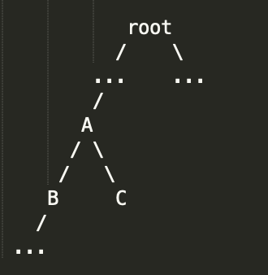
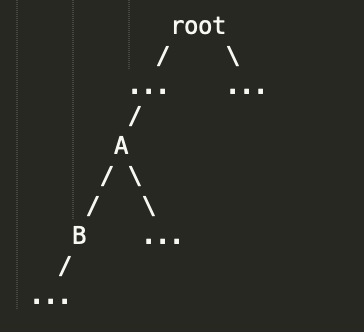

# 树(Tree)

树在iOS的面试题中是绝对的高频题，为何要这么说？因为

* 众所周知，iOS编程中的视图(UIView)就是一个N-Node的树形结构，也就是说面试题很容易地就可以和树的题目结合起来。
* 树的题目也涉及到到BFS，DFS，递归等题目，如果要考比较难的算法题，那么这也是一个非常好的主题。

不过，在讨论树的问题之前，我们先来讨论一下递归的思路。

## 递归思路

递归是一个非常有趣的思考和解决问题的方式，但是对于没有熟练掌握递归编程思路的程序员来说，对递归总有一些莫名的恐惧（包括刚毕业时候的我）。不过当真正掌握了递归之后，你会觉得递归其实并不是很难。

递归的结构从本质上看，就是一个树形结构，这也是为什么将树要先讲递归。用一个入门级的递归题目作为例子：求第N项斐波那契数列。这是一道最最基本的递归的题目，任何一个接触过递归的人都能够写，甚至是默出来。

假设我们需要求f(4)，那么我们就可以根据递归调用的过程，画出下面的树状结构：


递归从本质上来说就是一个函数不断地调用自己的过程，那么在这个过程中，我们可以看到，递归在调用到f(0)和f(1)时就不再向下递归，将直接返回0或1；而我们要求的`f(2)`，则是先求`f(1)`和`f(0)`，然后将两者的返回值相加，并将这一个结果返回f(3)。

上面的这道题目虽然十分基本，但是它却道出了递归的本质。我们也可以将其称为递归三要素，这也是我们在写代码之前需要明确的逻辑：

* 递归结束的条件
* 递归方法在每一层的调用中需要做什么
* 返回值是什么（可以返回空）

这里我们来看看这三要素是如何反映在斐波那契数列这一题中的。

* 结束条件：递归在调用到f(0)和f(1)时就不再向下递归，将直接返回0或1。
* 在每一层的调用中需要做什么: 将`f(x - 1)`与`f(x - 2)`的值相加
* 返回值：返回`f(x- 1)`和`f(x - 2)`的和

以上这三条要素构成了递归的总体思路，明确了这三条逻辑之后，就能够轻松地写出代码。

## 树的遍历(Tree Travsel)

树的遍历主要有两种方式，BFS和DFS，这里就不详细展开了，毕竟这是基础中的基础。下面我们来看一道经典的题目：

打印一个UIView的所有Subviews，并且按照以下的格式

> view1 frame(...  
>
> ​	view11 frame(...		
>
> view2 frame(...		  
>
> ​	view21 frame(		 
>
> ​	 view22 frame(	

这是一道Google Onsite的题目，算是一道热身题，而且这也是一道十分高频的题目。可以看到，按照题目的要求，我们需要先打印`View1`和它所有的Subview，然后再打印`View2`和它所有的子视图。那么我们就需要选用DFS的方式来循环整个视图树。需要注意的是在子视图前面有按照层树的缩进，我们也要在写代码时进行考虑。

这并不是一道十分难的题目，我们只要在进行DFS的时候将当前的层数传导下一层的递归调用就可以了，具体的代码如下：

``` swift
func printAllSubViews(_ view: UIView?) {
  guard let view = view else { return }
  for subview in view.subviews {
    printAllSubViews(subview, 0)    
  }
}

func printAllSubViews(_ view: UIView, _ level: Int) {
    var viewString = ""
    for _ in 0 ..< level {
        viewString += " "
    }
    viewString += view.description
		print(viewString)
    for subview in view.subviews {
        printAllSubViews(subview, level + 1)
    }
}
```

写完之后我们再来回顾一下之前提到的递归三要素吧，具体到这道题里面它们都是什么。

* 结束条件：如果当前的`view`没有`subview`的话，我们就不继续向下递归（隐式）。

* 在每一层的调用中需要做什么: 我们根据传入的层数和`view`建立字符串，并打印；然后对当前`view`的所有`subview` 调用`printAllSubViews(_ view: UIView, _ level: Int)`，并将`level + 1`传入下一层

* 返回值：无，我们已经直接打印了结果。

  

看完了上面的题，我们再来看下一道Facebook On-Site中的题

> Given a touch point(CGPoint), write a function to get the touched view in a given view hierarchy 

这道题目本质上就是通过不断的DFS遍历整个`View Tree`，找到`View Tree中`最下层的包含当前触摸点的View；只是有一个特殊情况我们需要考虑，就是当触摸点在数个Subview的交叉区域上，我们需要返回最上面的一个Subview。那么在这种情况下，我们需要充分地利用`view.subviews`这个属性，因为后加入的subview总是会显示在屏幕的最上方。所以在做DFS遍历的时候，我们需要从`view.subviews`的最后一个`subview`开始检查。具体的代码如下：

```swift
func findTouchView(_ point: CGPoint, _ view: UIView) -> UIView? {
		let point = view.convert(point, to: nil)
    let globalFrame = view.convert(view.frame, to: nil) //先将view的frame和point转化为它在window中的坐标

    if globalFrame.contains(point) {
        for subview in view.subviews.reversed() {
            if let foundedView = findTouchView(point, subview) {
                return foundedView
            }
        }
        return view
    } else {
        return nil
    }
}
```

与之前一道题一样，这里也涉及到了递归的三要素，我们一起来看一下：

* 结束条件：如果当前的`view`没有`subview`或者不包含`point`的话我们就不继续向下递归（隐式）。

* 在每一层的调用中需要做什么: 我们检查传入的`point`是否在当前的`view`中，如果在，我们从`view.subviews`的末尾开始继续检查它的每一个`subview`。

* 返回值：如果当前的`view`不包括`point`，我们返回nil；如果当前的`view`包含`point`，我们1）返回该`view`如果它的所有`subview`都不包含`point`;2)返回第一个返回值不为`nil`的`findTouchView`的返回结果。

## 树的Path

树的Path问题指的是与一棵树中从某一个节点到另一个节点形成的路径有关的问题。这类题目难度变化较大，可以比较简单，也可以问的很难。不过有关树的题目归根结底还是一道递归的题目，所以只要牢牢地记住上面所说的递归三要素，那么面对再难的题目我们至少还是有一定的解决的思路。

我们先来看一道简单的题目：

[Path Sum II](https://leetcode.com/problems/path-sum-ii/)

这道题目并不是很难，题目问的是返回所有从root节点到leaf节点所有节点之和等于`target`的路径。根据dfs的定义，当我们从`root`开始做`dfs`时，当我们检查到任意一个`leaf`节点时，我们就得到了一条从`root`到该`leaf`的路径。由于`dfs`的本质就是递归，所以我们继续使用我们递归三要素的原则来思考如何解决这道题：

* 结束条件：当我们检查到`leaf`节点时，我们就应该结束这一轮的`dfs`，并检查当前的`path`是否符合要求，如果符合的话，我们将当前的`path`加入到我们最终的`result`中。
* 在每一层的调用中需要做什么: 我们将当前的节点加入我们的path中，并将该path传入左右两个子树的递归中。
* 返回值：返回空。

有了思路之后，我们来看看具体的代码：

``` swift
private var res: [[Int]] = [] // 我们使用一个全局变量来记录最后的结果
    
func pathSum(_ root: TreeNode?, _ sum: Int) -> [[Int]] {
    res = []
    var path: [Int] = []
    helper(root, &path, sum)
    return res
}

// 我们将path参数定义为inout，当我们这么做的时候，在左右子树递归结束后，我们需要将加入了path之中的当前节点删除
// 同时，sum被定义为target - (sum of current path nodes)，为了便于终止条件的检测。
private func helper(_ node: TreeNode?, _ path: inout [Int], _ sum: Int) {
    guard let node = node else { return }
    if sum == node.val && node.left == nil && node.right == nil {
        path.append(node.val)
        res.append(Array(path))
        path.removeLast()
        return
    }
    path.append(node.val)	
    helper(node.left, &path, sum - node.val)
    helper(node.right, &path, sum - node.val)
    path.removeLast()
}
```

上面的这道题并不是很难，下面我们在来看一道LC hard的题

[Binary Tree Maximum Path Sum](https://leetcode.com/problems/binary-tree-maximum-path-sum/)

与上面的题不同的是，这道题关于`path`的定义不同，这里的path定义为从一个节点到其他任意一个节点所组成的路径。所以我们并不能简单地套用上面这道题的模板。那么我们要如何解决这道题呢？别着急，我们先从path的定义入手，看看要有哪些情况可以构成题目描述中的`path`。

* 第一种情况：path从一个`node`到另一个`node`。[B--A--C]

  

* 第二种情况： path从一个`node`到树的`root`的路径中的某一个`node`。[A--B]

  

既然我们已经确定了这两种可能构成`path`的情况后，我们来看看我们要如何来解这道题呢？

先来看看构成`path`两种情况，仔细观察之后，我们可以看到，在这两种情况下，`node A`都是包含在path中的。那么，当我们在进行当前节点（A）的检查时，如果我们得到来自左右子树第二种`path`的结果时，我们是不是就能够确定一节点A为root构成的path或者其为path的一端时的能够得到的最大的和了？有了这个思路，我们来看看代码是如何写的：

``` swift
private var res: Int = 0
    
func maxPathSum(_ root: TreeNode?) -> Int {
    res = root?.val ?? 0
    maxPathSumHelper(root)
    return res
}

private func maxPathSumHelper(_ root: TreeNode?) -> Int {
    guard let root = root else { return 0 }

    let leftPathSum = max(maxPathSumHelper(root.left), 0)
    let rightPathSum = max(maxPathSumHelper(root.right), 0)

    let archSum = root.val + leftPathSum + rightPathSum // 第一种情况的path
    let maxValStartFromCurrent = max(max(leftPathSum, rightPathSum) + root.val, root.val) // 第二种情况的path

    res = max(res, max(archSum, maxValStartFromCurrent)) // 更新我们的global max value
    return maxValStartFromCurrent // 返回第二种情况的最大值
}
```

最后，按照惯例，我们来看一看递归三要素：

* 结束条件：如果当前节点为nil，我们返回0
* 在每一层的调用中需要做什么: 我们得到以左右两个`node`为`root`构成的第二种`Path`的和，并且计算两种`Path`的值，并更新我们的`result value`
* 返回值：返回以当前节点为path的一端构成的第二种`path`的最大的和。