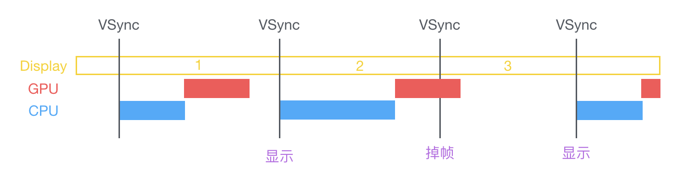

# UIKit

`UIKit`绝对是iOS编程中日常使用频率最高的系统框架了，面试的时候面试官也会适当地问一问关于UIKit的一些知识来测试面试者对于语言的熟练度。这一节中我们来看一看一些常见的UIKit的问题。

### UIView与CALayer的关系

先说结论：`UIView`是`CALayer`的一个`Wrapper Class`，也是`CALayer`的一个`delegate`。两者的关系可以用下面的图来概括：


根据[官方文档](https://developer.apple.com/documentation/quartzcore/calayer)的定义

> Layers are often used to provide the **backing store** for views but can also be used without a view to display content. A layer’s main job is to manage the visual content that you provide but the layer itself has visual attributes that can be set, such as a background color, border, and shadow.

那么为什么要说UIView是CALayer的一个delegate呢？我们来看一个简单的例子：

``` swift
print(view.action(for: view.layer, forKey: "position"))
        
UIView.animate(withDuration: 0.3) {
    print(self.view.action(for: self.view.layer, forKey: "position"))
}

// Print:
// Optional(<null>)
// Optional(<_UIViewAdditiveAnimationAction: 0x604000220000>)
```

大概解读一下这段代码：

当CALayer的某一个能够被执行动画的属性被修改之后，CALayer就会开始搜索是否存在一个实现了`CAAction`协议的实例来执行这个动画。而这其中的第一步，就是通过`action(for layer: CALayer, forKey event: String) -> CAAction?`方法向与其所关联的UIView询问是否存在这样的一个`CAAction`。一般来说，这个UIView有2个选择：

* 返回一个实现了CAAction协议的实例，CALayer会执行这个CAACtion。
* 返回nil，告诉CALayer在这个UIView中不存在这样的CAAction。

总结一下，CALayer和UIView相比更加**轻量化**，更加关注于图形的显示。所以如果需要追求极致的性能优化，那么可以使用一些CALayer；

UIView和CALayer相比则多出了处理用户交互的任务和管理CAAction的任务。

### UI的刷新机制

关于UI的刷新机制，可以用下面的图来概括：



iPhone的屏幕刷新频率是60帧，也就是每16ms（毫秒）GPU就要重新从上至下，从左至右重绘一次屏幕。

GPU 有一个机制叫做垂直同步（简写也是 V-Sync），当开启垂直同步后，GPU 会等待显示器的 VSync 信号发出后，才进行新的一帧渲染和缓冲区更新。通常来说，iOS默认会开启垂直同步，在 VSync 信号到来后，系统图形服务会通过 CADisplayLink 等机制通知 App，App 主线程开始在 CPU 中计算显示内容，比如视图的创建、布局计算、图片解码、文本绘制等。随后 CPU 会将计算好的内容提交到 GPU 去，由 GPU 进行变换、合成、渲染。随后 GPU 会把渲染结果提交到帧缓冲区去，等待下一次 VSync 信号到来时显示到屏幕上。由于垂直同步的机制，如果在一个 VSync 时间内，CPU 或者 GPU 没有完成内容提交，则那一帧就会被丢弃，等待下一次机会再显示，而这时显示屏会保留之前的内容不变。如果出现了这样的情况，那就会出现所谓的『掉帧』现象。

