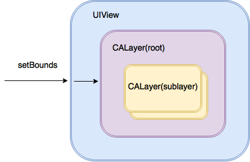

# UIKit

`UIKit`绝对是iOS编程中日常使用频率最高的系统框架了，面试的时候面试官也会适当地问一问关于UIKit的一些知识来测试面试者对于语言的熟练度。这一节中我们来看一看一些常见的UIKit的问题。

### UIView与CALayer的关系

先说结论：`UIView`是`CALayer`的一个`Wrapper Class`，也是`CALayer`的一个`delegate`。两者的关系可以用下面的图来概括：



根据[官方文档](https://developer.apple.com/documentation/quartzcore/calayer)的定义

> Layers are often used to provide the **backing store** for views but can also be used without a view to display content. A layer’s main job is to manage the visual content that you provide but the layer itself has visual attributes that can be set, such as a background color, border, and shadow.

那么为什么要说UIView是CALayer的一个delegate呢？我们来看一个简单的例子：

``` swift
print(view.action(for: view.layer, forKey: "position"))
        
UIView.animate(withDuration: 0.3) {
    print(self.view.action(for: self.view.layer, forKey: "position"))
}

// Print:
// Optional(<null>)
// Optional(<_UIViewAdditiveAnimationAction: 0x604000220000>)
```

大概解读一下这段代码：

当CALayer的某一个能够被执行动画的属性被修改之后，CALayer就会开始搜索是否存在一个实现了`CAAction`协议的实例来执行这个动画。而这其中的第一步，就是通过`action(for layer: CALayer, forKey event: String) -> CAAction?`方法向与其所关联的UIView询问是否存在这样的一个`CAAction`。一般来说，这个UIView有2个选择：

* 返回一个实现了CAAction协议的实例，CALayer会执行这个CAACtion。
* 返回nil，告诉CALayer在这个UIView中不存在这样的CAAction。

我们接着来思考一下，Apple为什么要这样设计呢？最大的原因在于要做职责分离，这样也能避免很多重复代码。在iOS和Mac OS两个平台上，事件和用户交互有很多地方的不同，基于多点触控的用户界面和基于鼠标键盘有着本质的区别，这就是为什么iOS有UIKit和`UIView`，但是Mac OS有AppKit和`NSView`的原因。他们功能上很相似，但是在实现上有着显著的区别。

总结一下，CALayer和UIView相比更加**轻量化**，更加关注于图形的显示。所以如果需要追求极致的性能优化，那么可以使用一些CALayer；

UIView和CALayer相比则多出了处理用户交互的任务和管理CAAction的任务。

### UI的刷新机制

关于UI的刷新机制，可以用下面的图来概括：


iPhone的屏幕刷新频率是60帧，也就是每16ms（毫秒）GPU就要重新从上至下，从左至右重绘一次屏幕。

GPU 有一个机制叫做垂直同步（简写也是 V-Sync），当开启垂直同步后，GPU 会等待显示器的 VSync 信号发出后，才进行新的一帧渲染和缓冲区更新。通常来说，iOS默认会开启垂直同步，在 VSync 信号到来后，系统图形服务会通过 CADisplayLink 等机制通知 App，App 主线程开始在 CPU 中计算显示内容，比如视图的创建、布局计算、图片解码、文本绘制等。随后 CPU 会将计算好的内容提交到 GPU 去，由 GPU 进行变换、合成、渲染。随后 GPU 会把渲染结果提交到帧缓冲区去，等待下一次 VSync 信号到来时显示到屏幕上。由于垂直同步的机制，如果在一个 VSync 时间内，CPU 或者 GPU 没有完成内容提交，则那一帧就会被丢弃，等待下一次机会再显示，而这时显示屏会保留之前的内容不变。如果出现了这样的情况，那就会出现所谓的『掉帧』现象。

### Frame、Bounds与Center的概念

这也是UIKit框架中常见的考题之一，三者的关系基本可以用下面的一张图来概括：


- Frame 是指当前视图（View）相对于**父视图**的平面坐标系统中的位置和大小。
- `Bounds` 是指当前视图相对于**自己**的平面坐标系统中的位置和大小。
- `Center` 是一个 `CGPoint`，指当前视图在**父视图**的平面坐标系统中最中间位置点 。


同时，当我们修改了上图中的`View B`的角度后，它的`bounds`不会变，但是`frame`却会变为能够容纳整个`View B`的矩形范围。

总结一下，`Frame`和`Center`都是针对**父视图（SuperView）**的，而`Bounds`是针对**自身（Self）**的。

其他的一些要点：

对于`UIKit`中的`UIScrollView`，它的内容移动机制就是通过修改`ContentView`的`bounds`来实现。刚兴趣的话可以阅读下面的文章：

[Understanding UIScrollView](https://oleb.net/blog/2014/04/understanding-uiscrollview/)

### storyboard/xib与纯代码构建 UI 的对比

|      | **storyboad/xib**                                            | 纯代码                                                       |
| ---- | ------------------------------------------------------------ | :----------------------------------------------------------- |
| 优点 | **简单直接。**直接拖拽和点选即可配置 UI，界面所见即所得。<br /> **跳转关系清楚。**Storyboards 中可以清楚的区分 View Controller 界面之间的跳转关系。而且在代码中，通过实现 prepare(for segue: UIStoryboardSegue, sender: Any?)，可以统一管理界面跳转和数据管理。<br />**屏幕适配** Storyboard和xib提供可视化的屏幕适配和**Size Class**选项，便于开发人员进行快速地开发 | **高性能**。与Storyboard和xib相比，纯代码构筑的UI界面性能比较高，XCode解析和绘制Storyboard需要消耗大量的资源。<br />**高复用**。纯代码构筑的UI可以轻松地被复用，甚至可以将构筑的UI打包到Package中实现多App的共用。<br />**便于追踪修改**。对比storyboard和xib，纯代码的布局在Git上更加直观，可以看到修改的过程。 |
| 缺点 | **协作冲突。**多人编辑时很容易产生冲突，且冲突很难解决。因为自带 Xcode 和系统的版本号，协作时 storyboard/xib 会在相同位置做同样修改，这样代码冲突几乎是不可避免的。解决方法是细分 storyboard 以及对应工程师的职责，但是这样同样带来了维护成本。 <br />**很难做到界面继承和重用。**代码中实现要容易和明确得多，然而 storyboard/xib 却很难做到。 <br />**不便于进行模块化管理。**storyboard/xib 中搜索起来很不方便，且统一修改多个 UI 控件的属性值不可能，必须一个一个改。在代码中一个工厂模式就可以搞定。<br />**性能影响。**storyboard/xib 在界面渲染上有时会成为性能杀手。 | **不直观**。除了在Playground和SwiftUI下，纯代码的布局需要大量的调试和编译，也需要开发者有足够的经验。<br />**需要大量的跳转代码**。VC之间的跳转需要大量的代码或者构建的Helper Class来实现，需要有经验的开发者维护和编写。 |

### AutoLayout与Frame布局的对比

* AutoLayout
  * **Auto Layout 是针对多尺寸屏幕的设计*：其本质是通过线性不等式对 UI 控件的相对位置进行设定，从而适配多种 iPhone/iPad 屏幕的尺寸。
  * **性能较差**：Auto Layout 的布局过程首先求解线性不等式，然后再转化为 Frame 去进行布局。其中求解的计算量非常大，通常 Auto Layout 的性能损耗是 Frame 布局的 10 倍左右。
  * **性能优化**：Auto Layout的布局计算是可以在后台线程中进行的，我们以此来加快界面的渲染，同时对于已经计算过的layout可以做缓存，减少二次运算带来的开销。有一些第三方SDK像Pinterest 的 Texture（前身是 ASDK ）就使用了这样的方式来进行性能优化。感兴趣的话可以参考下面的链接获得更多的信息：[Texture](https://texturegroup.org/)
* Frame
  * **Frame 是基于 xy 坐标轴系统的布局机制**：它从数学上限定了 UI 控件的具体位置，是 iOS 开发中最底层、最基本的界面布局机制。
  * **性能相对较优**：Frame布局直接通过代码得到控件的位置，能够跳过Autolayout的计算过程。